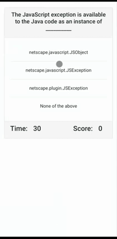

<h1 align="center">Welcome to countdown-quiz 👋</h1>
<p>
  
  <a href="https://github.com/jschrbr/countdown-quiz" target="_blank">
    
  </a>
</p>

> A quiz game that tests your (deprecated) js skills!! You have 30 seconds to answer as many questions as you can, but be careful, incorrect answers will deduct 2 seconds from the clock. Enter your initials to save your score and compete against your friends (on the same machine).

### 🏠 [Homepage](https://github.com/jschrbr/countdown-quiz)

### ✨ [Demo](https://jschrbr.github.io/countdown-quiz/)

## Usage

<div align="center">
<a href="https://jschrbr.github.io/countdown-quiz/">

</a>
</div>

```sh
Click start to begin a game. Answer as many questions as you can. When prompted enter your initals and click save. Rinse and repeat.
```

## Author

👤 **James Schreiber**

- Website: https://jschrbr.github.io/
- Github: [@jschrbr](https://github.com/jschrbr)
- LinkedIn: [@techsmechs](https://linkedin.com/in/techsmechs)

## Show your support

Give a ⭐️ if this project helped you!

<a href="https://www.patreon.com/techsmechs">
  
</a>

---

_This README was generated with ❤️ by [readme-md-generator](https://github.com/kefranabg/readme-md-generator)_
